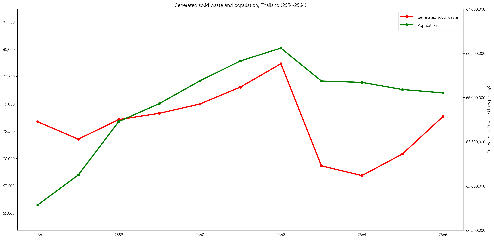
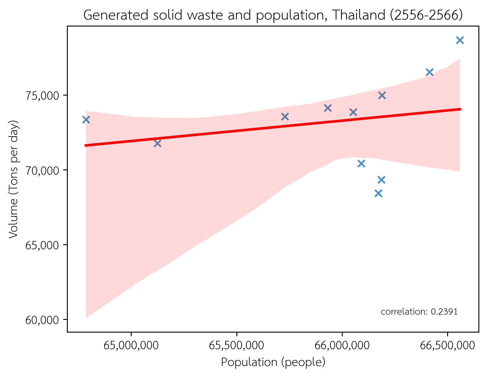
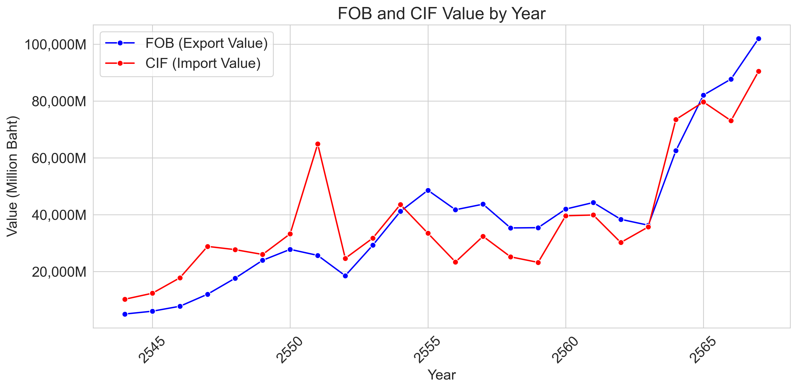

# __สถานการณ์ขยะในประเทศไทยเป็นยังไง__
&emsp;&emsp;&emsp;&emsp;ในปัจจุบันปริมาณขยะในประเทศไทยมีแนวโน้มเพิ่มขึ้นอย่างต่อเนื่อง ทั้งจากกิจกรรมในครัวเรือน การบริโภคในชีวิตประจำวัน และการพัฒนาเมืองที่ขยายตัวมากขึ้น ขยะที่เกิดขึ้นจำนวนมากไม่ได้เป็นเพียงปัญหาสิ่งแวดล้อมเท่านั้น แต่ยังสะท้อนถึงพฤติกรรมการใช้ทรัพยากรของสังคมและความสามารถของระบบจัดการขยะในแต่ละพื้นที่ จากความท้าทายนี้ เราจึงเกิดความสนใจที่จะศึกษาสถานการณ์ของขยะในประเทศไทย เพื่อเข้าใจภาพรวมของปริมาณขยะ การจัดการที่มีอยู่ และค้นหาแนวโน้มหรือปัจจัยที่ส่งผลต่อปัญหาขยะอย่างแท้จริง โดยหวังว่าจะนำไปสู่แนวทางที่ช่วยพัฒนาการจัดการขยะให้มีประสิทธิภาพและยั่งยืนมากยิ่งขึ้น โดยแบ่งเป็น 5 ส่วน ดังนี้  
1. [ปริมาณขยะที่เกิดขึ้นในประเทศไทย](#1ปริมาณขยะที่เกิดขึ้นในประเทศไทย)
2. [วิธีการจัดการขยะในประเทศไทย](#2วิธีการจัดการขยะในประเทศไทย)
3. [ความสัมพันธ์ของปริมาณขยะกับจำนวนประชากร](#3ความสัมพันธ์ของปริมาณขยะกับจำนวนประชากร)
4. [สถานการณ์การนำเข้าและส่งออกขยะของประเทศไทย](#4สถานการณ์การนำเข้าและส่งออกขยะของประเทศไทย)
5. [แนวทางพัฒนาการจัดการขยะให้มีประสิทธิภาพมากขึ้น](#5แนวทางพัฒนาการจัดการขยะให้มีประสิทธิภาพมากขึ้น)

## 1.ปริมาณขยะที่เกิดขึ้นในประเทศไทย
&emsp;&emsp;&emsp;&emsp;จากข้อมูลช่วงปี 2556–2566 (รูปที่ 1-1 และ รูปที่ 1-2) พบว่าปริมาณขยะมูลฝอยของประเทศไทยสูงสุดในปี 2562 เฉลี่ยเกือบ 80,000 ตันต่อวัน ก่อนจะลดลงอย่างชัดเจนในช่วงปี 2563–2564 จากผลกระทบของโควิด-19 ที่ทำให้กิจกรรมทางเศรษฐกิจและการบริโภคลดลง อย่างไรก็ตาม ปริมาณขยะเริ่มกลับมาเพิ่มขึ้นอีกครั้งในปี 2565–2566 สะท้อนการฟื้นตัวของเศรษฐกิจและสังคม หากพิจารณาจากกราฟจะเห็นว่าโดยรวมประเทศไทยมีแนวโน้มจัดการขยะได้ดีขึ้น ขยะที่กำจัดไม่ถูกต้องลดลง ขณะที่การรีไซเคิลและการกำจัดอย่างถูกต้องเพิ่มขึ้นต่อเนื่อง แม้ภาพรวมทั้งประเทศจะดูดีขึ้น แต่การวิเคราะห์ปริมาณขยะแยกรายจังหวัดจะช่วยให้เข้าใจสถานการณ์ในแต่ละพื้นที่ได้ชัดเจนและนำไปสู่การวางแผนจัดการขยะที่เหมาะสมมากขึ้น 

__
รูปที่ 1-1 ปริมาณขยะมูลฝอยของประเทศไทย ปี 2556–2566 (ตันต่อวัน)
__

__
รูปที่ 1-2 ปริมาณขยะมูลฝอยของประเทศไทย ปี 2556–2566 (เปอร์เซ็นต์)
__
&emsp;&emsp;&emsp;&emsp;จากแผนที่แสดงค่าเฉลี่ยปริมาณขยะมูลฝอยรายวันในแต่ละจังหวัดของประเทศไทยช่วงปี 2556–2565 พบว่า กรุงเทพมหานคร เป็นจังหวัดที่มีปริมาณขยะสูงที่สุดอย่างชัดเจน โดยแสดงเป็นพื้นที่สีแดงเข้ม ซึ่งบ่งชี้ถึงปริมาณขยะเฉลี่ยมากกว่า 12,000 ตันต่อวัน  ขณะที่จังหวัดอื่นส่วนใหญ่มีปริมาณขยะในระดับต่ำถึงปานกลาง (สีครีมถึงส้มอ่อน)  กรุงเทพมหานครมีปริมาณขยะเฉลี่ยรายวันสูงที่สุดในประเทศ โดยอยู่ที่ประมาณ 12,270 ตันต่อวัน ซึ่งสูงกว่าค่าเฉลี่ยของทั้งประเทศที่อยู่ที่เพียง 949.57 ตันต่อวัน อย่างชัดเจน สะท้อนให้เห็นถึงภาระด้านการจัดการขยะของกรุงเทพฯ ที่มากกว่าจังหวัดอื่นอย่างมีนัยสำคัญ 

__
รูปที่ 2-1 ปริมาณขยะมูลฝอยเฉลี่ยรายจังหวัดของประเทศไทย ปี 2556–2565
__

__
รูปที่ 2-2 ปริมาณขยะมูลฝอยเฉลี่ยสูงสุด 10 จังหวัดของประเทศไทย ปี 2556–2565 (ตันต่อวัน)
__
&emsp;&emsp;&emsp;&emsp;จากภาพรวมทั้งประเทศชี้ให้เห็นว่ากรุงเทพมหานคร มีปริมาณขยะเฉลี่ยต่อวันสูงกว่าจังหวัดอื่นอย่างเห็นได้ชัด เมื่อเจาะลึกรายเขตในกรุงเทพมหานคร พบว่าเขตจตุจักร เขตบางกะปิ เขตบางขุนเทียน  เขตคลองเตย และเขตประเวศ มีปริมาณขยะที่มากกว่าเขตอื่น 

__
รูปที่ 3 ปริมาณขยะมูลฝอยเฉลี่ยรายเขตของกรุงเทพฯ ปี 2556–2565
__
&emsp;&emsp;&emsp;&emsp;นอกจากนี้เมื่อพิจารณาข้อมูลประเภทขยะมูลฝอยในกรุงเทพมหานครช่วงปี 2563–2565 พบว่า ขยะเศษอาหาร เป็นประเภทที่มีอัตราส่วนมากที่สุด และมีแนวโน้มเพิ่มขึ้นทุกปี สะท้อนถึงปัญหาขยะอินทรีย์ที่ยังจัดการได้ไม่เต็มประสิทธิภาพ ขณะที่ขยะรีไซเคิลได้ เช่น กระดาษและพลาสติก มีสัดส่วนลดลงเล็กน้อย โดยสรุป ขยะอินทรีย์ยังคงเป็นปัญหาหลักของกรุงเทพฯ และแนวโน้มขยะรีไซเคิลที่ลดลง แสดงให้เห็นถึงความจำเป็นในการ ส่งเสริมการแยกขยะและรีไซเคิลตั้งแต่ระดับครัวเรือนอย่างจริงจัง เพื่อเพิ่มประสิทธิภาพในการจัดการและลดภาระของระบบกำจัดขยะในระยะยาว 

__
รูปที่ 4 สัดส่วนประเภทขยะมูลฝอยในกรุงเทพมหานคร ปี 2563–2565
__
## 2.วิธีการจัดการขยะในประเทศไทย
&emsp;&emsp;&emsp;&emsp;เมื่อทราบภาพรวมของปริมาณขยะในประเทศ โดยเฉพาะในพื้นที่กรุงเทพมหานครที่มีปริมาณขยะจำนวนมากซึ่งสูงกว่าค่าเฉลี่ยทั้งประเทศหลายเท่า นำมาสู่การศึกษาในขั้นถัดไปเกี่ยวกับ การจัดการขยะในแต่ละพื้นที่ โดยเฉพาะในแง่ของ สถานที่กำจัดขยะ และ พื้นที่ที่ใช้สำหรับการกำจัดขยะ เพื่อประเมินว่าโครงสร้างพื้นฐานในแต่ละพื้นที่มีความเพียงพอและเหมาะสมกับปริมาณขยะที่เกิดขึ้นหรือไม่ และจังหวัดใดที่อาจกำลังประสบกับภาวะพื้นที่รองรับขยะไม่เพียงพอ 

__
รูปที่ 5 ประเภทกระบวนการกำจัดขยะมูลฝอยประเทศไทย ปี 2565
__

__
รูปที่ 6 พื้นที่ที่ใช้ในการจัดการขยะแยกตามประเภทกระบวนการกำจัดขยะมูลฝอยประเทศไทย ปี 2565
__
&emsp;&emsp;&emsp;&emsp;จากกราฟแสดงพื้นที่ใช้ในการจัดการขยะแยกตามประเภทของกระบวนการกำจัดในแต่ละจังหวัด พบว่า การจัดการขยะส่วนใหญ่ในหลายจังหวัดยังคงพึ่งพาการ Dumping (สีแดง) เป็นหลัก ซึ่งเป็นวิธีที่ไม่มีการควบคุมด้านสิ่งแวดล้อมอย่างเพียงพอ โดยเฉพาะในจังหวัดที่มีพื้นที่จัดการขยะมาก เช่น  นครราชสีมา และขอนแก่น ใช้พื้นที่สำหรับการ Dumping ในสัดส่วนสูงมาก ขณะที่วิธีการที่ยั่งยืนกว่า เช่น การเผา (Incineration), การแปรรูปพลังงาน (Waste to Energy) หรือ การฝังกลบที่ถูกต้องตามหลักสุขาภิบาล (Landfilling) ยังมีการใช้งานในสัดส่วนที่ค่อนข้างน้อยในหลายจังหวัด สำหรับแนวทางการพัฒนาวิธีการจัดการขยะ ดังนี้ 
* ลดการพึ่งพาการ Dumping ด้วยการทยอยปิดหรือปรับปรุงพื้นที่ทิ้งขยะเปิดให้เป็นระบบที่มีการควบคุม เช่น การฝังกลบแบบสุขาภิบาล
* ส่งเสริมเทคโนโลยี Waste to Energy และเชื้อเพลิงทางเลือก โดยเฉพาะในจังหวัดที่มีขยะปริมาณมาก แต่ใช้พื้นที่กำจัดขยะอย่างไม่มีประสิทธิภาพ
* ลงทุนในระบบคัดแยกขยะและบำบัดแบบชีวภาพ (Biological treatment) มากขึ้นในระดับชุมชน เพื่อให้ขยะอินทรีย์ไม่ไหลเข้าสู่ระบบกำจัดรวม
* บริหารจัดการพื้นที่กำจัดขยะตามสัดส่วนปริมาณขยะจริงของแต่ละจังหวัด ไม่ใช่เพียงแค่ตามพื้นที่ที่มีอยู่ เพื่อให้เกิดความสมดุลระหว่างปริมาณขยะและขีดความสามารถของระบบ 

&emsp;&emsp;&emsp;&emsp;เมื่อมีข้อมูลทั้งปริมาณขยะและพื้นที่สำหรับจัดการขยะในแต่ละจังหวัดแล้ว การวิเคราะห์ความสัมพันธ์ระหว่างสองปัจจัยนี้จึงเป็นสิ่งสำคัญในการประเมินศักยภาพของระบบจัดการขยะอย่างแท้จริง จากกราฟพบว่า กรุงเทพมหานครมีปริมาณขยะต่อพื้นที่จัดการสูงถึง 0.161 ตันต่อวันต่อตารางเมตร ซึ่งสูงกว่าค่าเฉลี่ยของประเทศอย่างมาก สะท้อนถึงความหนาแน่นของขยะที่อาจเกินขีดความสามารถของสถานที่รองรับ ส่งผลให้ระบบจัดการในพื้นที่นั้นมีความเสี่ยงต่อการล้นของขยะหรือการจัดการที่ไม่มีประสิทธิภาพ การเปรียบเทียบในลักษณะนี้จึงช่วยระบุจังหวัดที่มีภาระสูง และสามารถนำไปสู่การออกแบบนโยบายหรือแนวทางพัฒนาที่เหมาะสม เช่น การกระจายจุดกำจัดขยะ การเพิ่มพื้นที่รองรับ หรือการพัฒนาเทคโนโลยีจัดการขยะที่ใช้พื้นที่น้อยแต่มีประสิทธิภาพสูง

## 3.ความสัมพันธ์ของปริมาณขยะกับจำนวนประชากร
&emsp;&emsp;&emsp;&emsp;กราฟแสดงแนวโน้มของ ปริมาณขยะมูลฝอยที่เกิดขึ้น (เส้นสีแดง) และ จำนวนประชากร (เส้นสีเขียว) ของประเทศไทยในช่วงปี 2556–2566 พบว่า ประชากร มีแนวโน้มเพิ่มขึ้นเรื่อย ๆ ตั้งแต่ปี 2556–2562 ก่อนจะลดลงเล็กน้อยและทรงตัวตั้งแต่ปี 2563 เป็นต้นมา ปริมาณขยะ เพิ่มขึ้นตามแนวโน้มประชากรจนถึงปี 2562 แต่ลดลงอย่างชัดเจนในช่วงปี 2563–2564 ซึ่งตรงกับช่วง โควิด-19 ที่กิจกรรมทางเศรษฐกิจและสังคมลดลง ก่อนจะเริ่มเพิ่มขึ้นอีกครั้งในปี 2565–2566

&emsp;&emsp;&emsp;&emsp;แม้จำนวนประชากรจะดูมีแนวโน้มสอดคล้องกับปริมาณขยะในบางช่วง แต่จากค่า Correlation ที่ต่ำแสดงว่า ยังมีปัจจัยอื่นที่ส่งผลต่อปริมาณขยะมากกว่าจำนวนประชากรเพียงอย่างเดียว ดังนั้น หากต้องการเข้าใจปัจจัยที่ส่งผลต่อปริมาณขยะอย่างแท้จริง ควรนำตัวแปรอื่นมาวิเคราะห์ร่วมด้วย

&emsp;&emsp;&emsp;&emsp;จากการวิเคราะห์ที่ผ่านมา พบว่า กรุงเทพมหานคร เป็นพื้นที่ที่มี ปริมาณขยะสูงที่สุดในประเทศ ทั้งในแง่ของปริมาณรวมและความหนาแน่นของขยะต่อพื้นที่จัดการ ซึ่งสะท้อนถึงภาระของระบบจัดการขยะในเมืองหลวงที่อาจเกินขีดความสามารถของสถานที่กำจัดขยะที่มีอยู่ ด้วยเหตุนี้ เราจึงให้ความสนใจในการศึกษาลงลึกไปที่ ระดับเขตในกรุงเทพฯ เพื่อทำความเข้าใจว่าแต่ละเขตมีสัดส่วนหรือภาระด้านขยะที่แตกต่างกันอย่างไร

&emsp;&emsp;&emsp;&emsp;จากกราฟแสดงค่า Correlation ระหว่างปริมาณขยะที่เกิดขึ้นกับจำนวนประชากร ในแต่ละเขตของกรุงเทพมหานคร (ช่วงปี 2556–2565) พบว่า เขตที่มี ความสัมพันธ์สูงที่สุด ได้แก่ ดอนเมือง (0.78) บางแค (0.75) สะท้อนว่าในเขตเหล่านี้ ปริมาณขยะมีแนวโน้มเพิ่มขึ้นตามจำนวนประชากรอย่างชัดเจน ส่วนเขตที่มี ความสัมพันธ์ต่ำ ได้แก่ ปทุมวัน บางรัก ลาดพร้าว จตุจักร ฯลฯ แสดงว่าในเขตเหล่านี้ จำนวนประชากรไม่ใช่ตัวแปรหลักที่ส่งผลต่อปริมาณขยะ อาจมีปัจจัยอื่น เช่น การท่องเที่ยว พื้นที่พาณิชยกรรม หรือกิจกรรมเชิงพาณิชย์ที่สร้างขยะมาก แม้ประชากรถาวรจะน้อย 
&emsp;&emsp;&emsp;&emsp;เนื่องจากการวิเคราะห์พบว่า บางเขตของกรุงเทพมหานครมีความสัมพันธ์ต่ำระหว่างจำนวนประชากรกับปริมาณขยะที่เกิดขึ้น ซึ่งอาจสะท้อนว่าปัจจัยอื่นนอกเหนือจากประชากรถาวรมีบทบาทในการสร้างขยะ เช่น การใช้งานพื้นที่ในรูปแบบเชิงพาณิชย์ แหล่งท่องเที่ยว หรือกิจกรรมพิเศษในพื้นที่นั้น ๆ ดังนั้น จึงได้มีการ สำรวจข้อมูลจากระบบตรวจสอบร่างผังเมืองรวมกรุงเทพมหานคร เพื่อทำความเข้าใจ ลักษณะการใช้ประโยชน์ที่ดินในแต่ละเขต (เช่น พื้นที่พาณิชยกรรม เขตอุตสาหกรรม ที่อยู่อาศัยหนาแน่นต่ำ-สูง หรือพื้นที่อนุรักษ์) จากแผนที่พื้นที่โซนกลางของกรุงเทพมหานคร (สีแดง) เป็นที่ดินประเภทพาณิชยกรรม ซึ่งสามารถอนุมานได้ว่าเป็นแหล่งที่มีนักท่องเที่ยวจำนวนมาก ซึ่งปัจจัยนี้อาจทำให้ความสัมพันธ์ระหว่างปริมาณขยะ และจำนวนประชากรในบางเขตมีความสัมพันธ์ต่ำ

## 4.สถานการณ์การนำเข้าและส่งออกขยะของประเทศไทย
&emsp;&emsp;&emsp;&emsp;ในช่วงหลายปีที่ผ่านมา การจัดการขยะในประเทศไทยไม่ได้จำกัดอยู่เพียงแค่การบริหารภายในประเทศเท่านั้น แต่ยังเกี่ยวข้องกับการ นำเข้าและส่งออกขยะระหว่างประเทศ โดยเฉพาะขยะที่สามารถรีไซเคิล หรือแปรรูปได้ เช่น ขยะพลาสติก เศษโลหะ และขยะอิเล็กทรอนิกส์ 
&emsp;&emsp;&emsp;&emsp;จากกราฟทั้งสองภาพแสดงให้เห็นแนวโน้มของปริมาณและมูลค่าการนำเข้า ส่งออกขยะของประเทศไทยตั้งแต่ปี 2000–2024 โดยพบว่า ปริมาณการนำเข้าและส่งออกขยะเพิ่มขึ้นอย่างต่อเนื่องในช่วงหลังปี 2020 สะท้อนถึงบทบาทของไทยในระบบการค้าขยะระหว่างประเทศที่ขยายตัวมากขึ้น ขณะเดียวกัน กราฟมูลค่าการค้า มูลค่าการส่งออก (FOB) มีแนวโน้มเพิ่มขึ้นชัดเจน และในช่วงปีหลัง ๆ เริ่มสูงกว่ามูลค่านำเข้า (CIF) ซึ่งสะท้อนว่าไทยอาจเริ่มมีศักยภาพในการคัดแยกหรือรีไซเคิลวัสดุเพื่อส่งออกในเชิงพาณิชย์มากขึ้น อย่างไรก็ตาม การนำเข้ายังอยู่ในระดับสูง จึงควรมีการศึกษาความเหมาะสมของปริมาณขยะที่หมุนเวียน รวมถึงขีดความสามารถของระบบจัดการภายในประเทศ เพื่อประเมินว่าหากจำกัดการนำเข้าในอนาคต ระบบจะยังคงรองรับได้เพียงพอหรือไม่

&emsp;&emsp;&emsp;&emsp;จากข้อมูลช่วงปี 2022–2024 พบว่า ขยะประเภทไม้ ไทยนำเข้าและส่งออกมากที่สุด ตามปริมาณ ส่วนในด้านมูลค่า ขยะที่มีราคาสูงสุดในการส่งออกคือทองแดง แม้จะมีปริมาณไม่มาก แต่มีราคาสูง ส่วนฝั่งนำเข้า อลูมิเนียม เป็นขยะที่ไทยนำเข้าเยอะที่สุดในแง่ของมูลค่า ซึ่งสะท้อนว่าภาคอุตสาหกรรมในไทยยังต้องใช้วัตถุดิบประเภทนี้สูง ข้อมูลนี้ช่วยให้เห็นว่าไทย มีศักยภาพในการส่งออกขยะบางประเภทที่มีมูลค่าสูง และในขณะเดียวกันก็ยัง ต้องพึ่งพาการนำเข้าขยะบางประเภทเพื่อใช้ในภาคการผลิต ดังนั้นควรมีการวางแผนให้สมดุลระหว่างสิ่งแวดล้อมกับประโยชน์ทางเศรษฐกิจ

## 5.แนวทางพัฒนาการจัดการขยะให้มีประสิทธิภาพมากขึ้น
* แนวทางการพัฒนาการบริหารจัดการขยะในประเทศไทยควรเริ่มจากกรุงเทพมหานคร และจังหวัดอื่นๆ ที่มีปริมาณขยะสะสมมากแต่พื้นที่ในการจัดการขยะไม่เพียงพอ โดยควรเน้นการเพิ่มประสิทธิภาพของสถานที่กำจัดขยะ เช่น ขยายพื้นที่รองรับขยะ พัฒนาเทคโนโลยีคัดแยก รีไซเคิล และแปรรูปขยะเป็นพลังงาน โดยส่งเสริมการคัดแยกตั้งแต่ในครัวเรือน 
* จากการวิเคราะห์พบว่า ความสัมพันธ์ระหว่างจำนวนประชากรกับปริมาณขยะ มีค่าสหสัมพันธ์ต่ำ (correlation) สะท้อนว่าปริมาณขยะไม่ได้สัมพันธ์กับจำนวนประชากรถาวรเท่านั้น แต่ยังเกิดจากปัจจัยอื่น เช่น กิจกรรมทางเศรษฐกิจ การท่องเที่ยว การใช้ประโยชน์ที่ดิน ลักษณะพฤติกรรมของผู้อยู่อาศัย เป็นต้น ดังนั้น การวางแผนจัดการขยะนอกจากพิจารณาจำนวนประชากรแล้วควรพิจารณาข้อมูลอื่นประกอบด้วย 
* การนำเข้าและส่งออกขยะมีบทบาทสำคัญต่อการบริหารจัดการขยะ โดยเฉพาะขยะประเภท ไม้ อลูมิเนียม และทองแดง ที่หมุนเวียนสูง ทั้งในแง่ของปริมาณและมูลค่า จึงควรมีการวิเคราะห์ความจำเป็นของการนำเข้า ว่าอุตสาหกรรมในประเทศสามารถใช้วัสดุจากขยะในประเทศได้มากน้อยเพียงใด เพื่อลดการนำเข้า และในขณะเดียวกันควร ส่งเสริมการแปรรูปขยะเพื่อการส่งออก ในกลุ่มที่มีมูลค่าสูงอย่างมีมาตรฐาน ทั้งหมดนี้ควรดำเนินควบคู่ไปกับการกำหนดนโยบายระดับชาติที่ เชื่อมโยงระหว่างสิ่งแวดล้อม เศรษฐกิจ และสังคม 
 
# __แหล่งที่มาข้อมูล__
- [มูลค่าและปริมาณการนำเข้าส่งออกขยะ](https://www.customs.go.th)
- [ข้อมูลปริมาณขยะมูลฝอยรายเขต กรุงเทพฯ](https://webportal.bangkok.go.th)
- [สถิติปริมาณขยะมูลฝอยรายจังหวัดและทั้งประเทศ](https://stathub.nso.go.th)
- [ข้อมูลสถานที่กำจัดขยะมูลฝอย 2565](https://pcd.gdcatalog.go.th)
- [ข้อมูลจำนวนประชากรทั้งประเทศและรายเขต กรุงเทพฯ](https://stat.bora.dopa.go.th)
- [ข้อมูลขอบเขตการปกครอง 1](https://data.humdata.org)
- [ข้อมูลขอบเขตการปกครอง 2](https://geojson-maps.kyd.au)
- [แผนที่การใช้ประโยชน์ที่ดิน](https://cpudgiportal.bangkok.go.th/portal/apps/webappviewer/index.html?id=3ce8216cd37140409bcc99385a02bd21)
